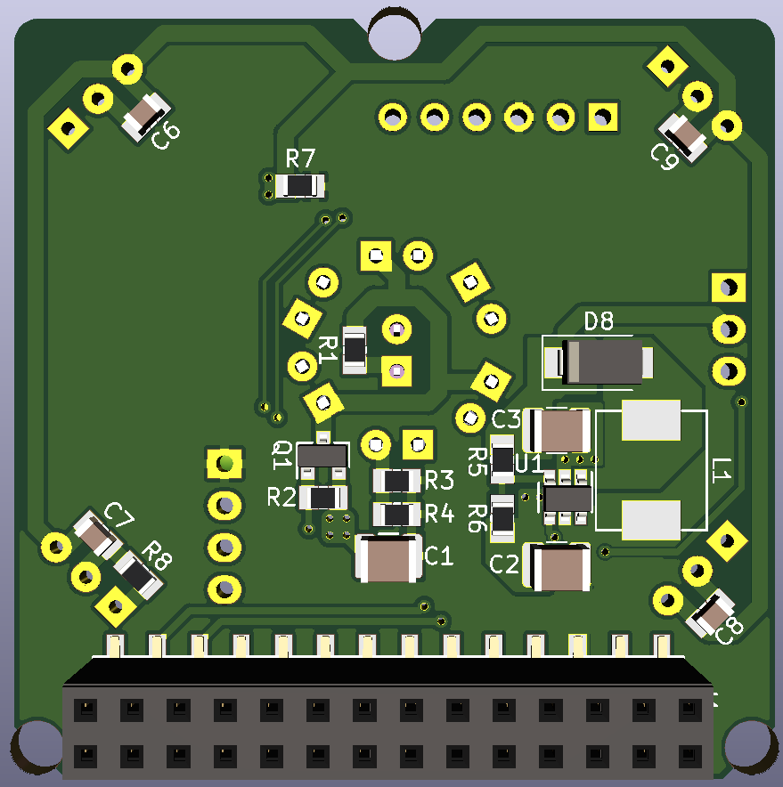

# SHMod24 Addon: RF/IR Bridge

This addon is meant to be plugged onto a [SHMod24](https://github.com/LeoDJ/SHMod24) base board.
It provides the ability to send and receive infrared and 433MHz RF remote control codes.

**Current status**: a prototype PCB batch has been ordered and will be tested for functionality

## 3D Preview

|  |  |
| :--------------- | :------------------ |
|              |                 |

## BOM
There are multiple different module groups that can be populated.

 In the table is listed, which components to populate for a given module:

| Module                         | Reference | Part                    |
| :----------------------------- | :-------- | :---------------------- |
| **IR LED Array**               | Q1        | AO3400A                 |
|                                | R1        | 15Ω                     |
|                                | R2        | 10k                     |
|                                | R3, R4    | 2Ω                      |
|                                | C1        | 22µF, 1210              |
|                                | D1 - D7   | IR LED 5mm              |
|                                |           |                         |
| **IR Receiver Array**          | R7        | 100Ω                    |
|                                | C4        | 100µF, 6.3x5.8          |
|                                | R8        | 47k                     |
|                                | C6 - C9   | 100n                    |
|                                | IR1 - IR4 | VS1838b                 |
|                                |           |                         |
| **433MHz 12V Boost Converter** | U1        | MT3608                  |
| Can also be bypassed by        | R5        | 180k                    |
| bridging L1 and D8 to run      | R6        | 10k                     |
| 433MHz transmitter at 3.3V     | D8        | SS34 Schottky, SMA      |
|                                | C2, C3    | 22µF, 1210              |
|                                | L1        | 4.7µH, 0630             |
|                                |           |                         |
| **433MHz Receiver**            | RF1       | Generic China 433MHz RX |
|                                |           |                         |
| **433MHz Transmitter**         | RF2       | Generic China 433MHz TX |

## Project installation
- Make sure to run `git clone` with `--recurse-submodules` to include the necessary libraries too.