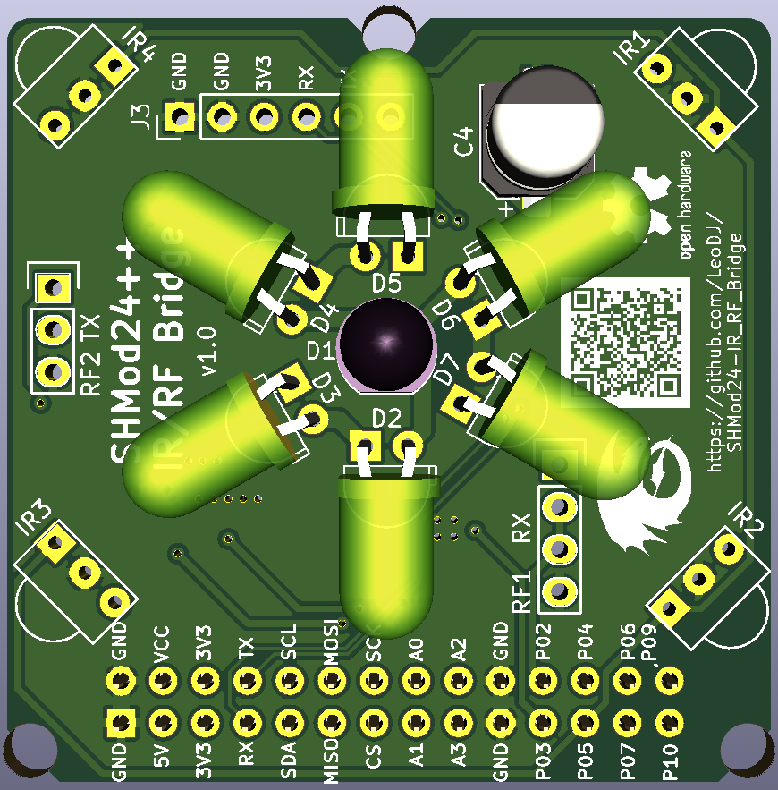

# SHMod24 Addon: RF/IR Bridge

This addon is meant to be plugged onto a [SHMod24](https://github.com/LeoDJ/SHMod24) base board.
It provides the ability to send and receive infrared and 433MHz RF remote control codes.

**Current status**: a prototype PCB batch has been ordered and will be tested for functionality

## 3D Preview

|      |    |
| :------------------- | :-------------------- |
|                  |                   |

## Project installation
- Make sure to run `git clone` with `--recurse-submodules` to include the necessary libraries too.